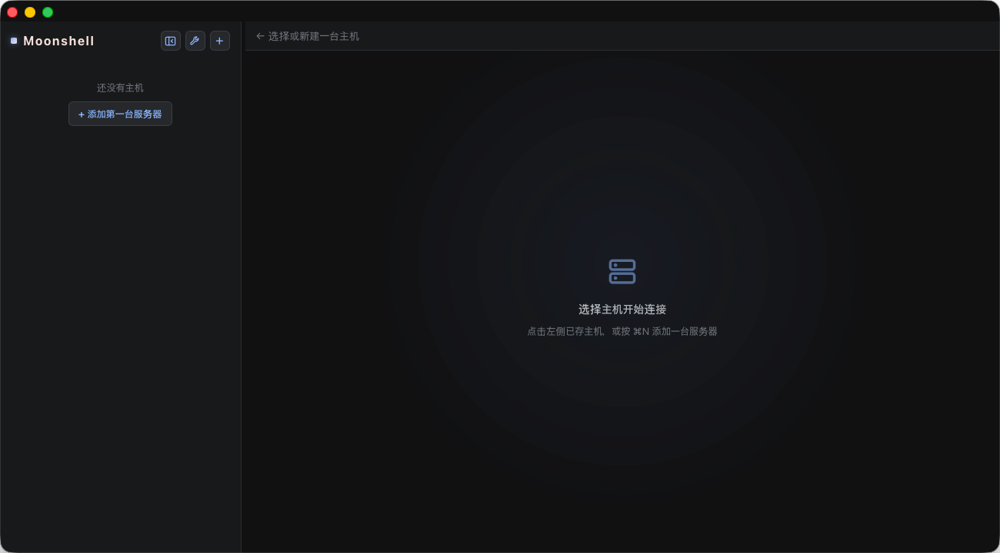
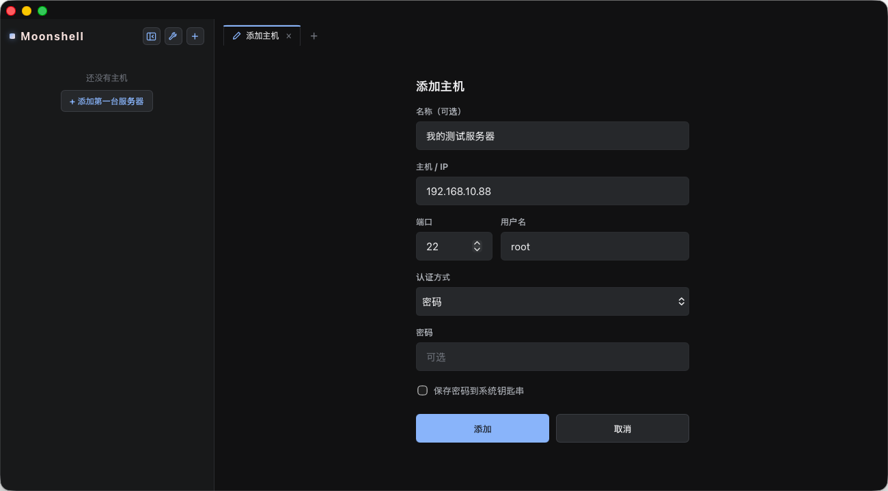

# Moonshell

[English](README.md) · [日本語](README.ja.md) · **简体中文**

1. 基于 Tauri 构建的轻量 macOS SSH 客户端 —— 使用系统 WebView，内存占用不到 50 MB。  
2. 快速、低内存占用的 macOS SSH 客户端。通过 Tauri + Rust（russh）调用原生 WebView，内存仅数十 MB，而非数百 MB。  
3. 精简的 macOS SSH/SFTP 客户端。Tauri + Rust + xterm.js，不打包 Chromium。

## 截图

| 主界面 | 添加主机 |
|---|---|
|  |  |

## 功能

- **SSH 登录** — 密码与私钥认证,私钥口令每次连接询问、不落盘
- **网页终端** — xterm.js 全功能终端,双向回显、窗口自适应 resize
- **多会话** — 每条连接独立 PTY,各跑各的异步任务
- **手动重连** — 断开后一键重连,复用已存凭证
- **主机管理** — 侧栏增删改、一键连接
- **本地持久化** — 主机列表存 SQLite,清缓存 / WebView 重置不丢
- **密码安全** — 密码存 macOS Keychain,明文不入库
- **known_hosts 校验** — 未知主机弹窗确认指纹后才信任,密钥变更拒绝连接
- **SFTP 传输** — 远端目录浏览、上传 / 下载、新建 / 删除 / 重命名
- **监控面板** — 周期采样远端指标,无需在服务器装 agent
- **主题** — 浅色 / 深色 / 跟随系统,5 种强调色
- **终端字号可调**
- **多语言** — 简体中文、日本語、English、Français、Deutsch、Español

## 技术栈

- **壳/后端**:[Tauri 2](https://tauri.app) + Rust(系统 WebView,非打包 Chromium)
- **UI**:Svelte 5 + SvelteKit(SPA 模式,`ssr = false`)
- **终端**:[xterm.js](https://xtermjs.org) + fit 插件
- **SSH/PTY**:[russh](https://crates.io/crates/russh) 0.61(纯 Rust 异步)

## 架构

```
xterm.js (网页终端)  ⇄  Tauri IPC  ⇄  Rust 连接管理器  ⇄  russh (SSH/PTY)  ⇄  服务器
```

- 后端核心:`src-tauri/src/ssh.rs`
  - 每个会话 = 一条 russh 连接上的一个 PTY+shell channel,跑在独立 async 任务里
  - 任务用 `select!` 同时:读服务器输出 → 经每会话 `tauri::ipc::Channel` 直传字节给 xterm;收前端命令 → 写回 channel
  - 命令:`ssh_connect` / `ssh_write` / `ssh_resize` / `ssh_disconnect`
- 前端:`src/routes/+page.svelte`(连接表单 + xterm,监听 `ssh-output`/`ssh-closed`)

## 安装 / 运行

前置:Node.js + [pnpm](https://pnpm.io)、Rust 工具链(`rustup`)、Xcode Command Line Tools。

```bash
pnpm install        # 装前端依赖

pnpm tauri dev      # 跑起 App(首次会编译整个 Rust 二进制,稍久)
pnpm check          # svelte-kit sync + svelte-check 类型检查(改完前端先跑这个)
pnpm tauri build    # 打包,产出 .app / .dmg
```

> `pnpm tauri dev` 用来连 SSH。只跑 Vite 前端(没有 Rust 壳)的命令一般用不到。

## License

[Apache License 2.0](LICENSE) © 2026 Moonya
